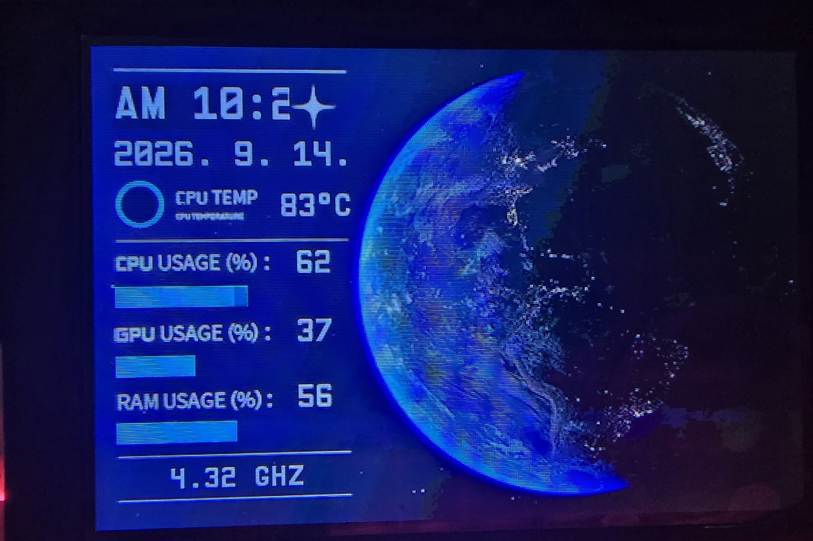
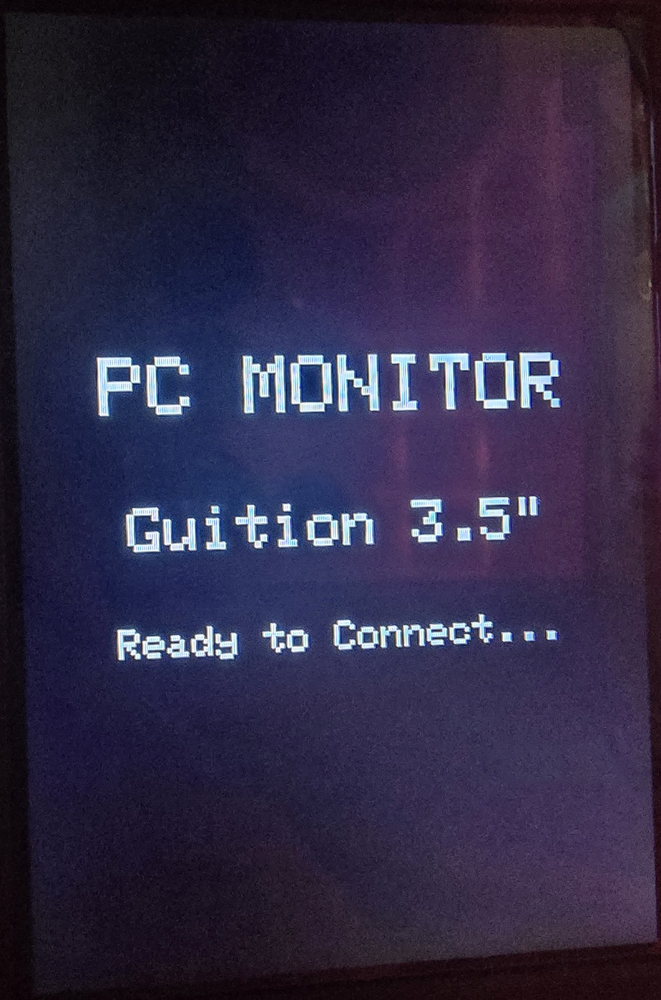
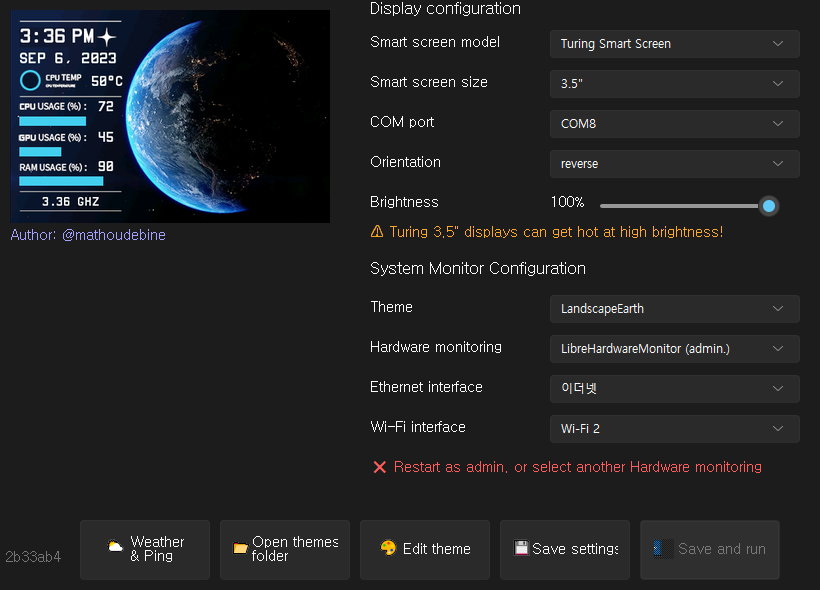

# Guition 3.5" IPS USB-C 스마트 스크린 - PC 모니터링 프로그램

[English (README.md)](README.md) | **한국어**

**Guition 3.5인치 IPS USB Type-C 보조 모니터**(ESP32-C3 + ST7796)를 위한 오픈소스 PC 시스템 모니터링 소프트웨어 및 커스텀 펌웨어 패키지입니다.

> [!NOTE]
> **프로젝트 원 출처 안내 (Upstream Project)**:
> 본 패키지의 PC 시스템 모니터링 프로그램 원 출처는 **[mathoudebine/turing-smart-screen-python](https://github.com/mathoudebine/turing-smart-screen-python)** (원작자: Matthieu Houdebine) 오픈소스 프로젝트입니다. Guition 3.5인치 ESP32-C3 하드웨어 호환 및 80MHz 고속 통신 최적화를 거쳐 구성되었습니다.
>
> ⚡ **전용 펌웨어 저장소**:
> 80MHz SPI DMA 커스텀 펌웨어 소스코드, 빌드된 `.bin` 바이너리 및 웹 플래셔 가이드는 **[q20021410/Guition-ESP32-C3-Fimrware](https://github.com/q20021410/Guition-ESP32-C3-Fimrware)** 전용 저장소에 분리 보관되어 있습니다.
>
> 📦 **무설치 포터블 배포판**:
> 파이썬 설치 없이 다운로드 후 바로 사용할 수 있는 단독 실행 바이너리는 **[Guition.Turing.zip 다운로드 (v1.0.0)](https://github.com/q20021410/Guition-Turing-Smart-Screen/releases/latest)** 에서 받으실 수 있습니다.

---

## 📷 실제 구동 사진 & 인터페이스 미리보기

<div align="center">

| 🖥️ 실시간 모니터링 구동 화면 (Landscape) | ⏳ 펌웨어 대기 화면 (Standby) |
| :---: | :---: |
|  |  |
| **실시간 시스템 모니터링 (480x320 가로 모드)**<br/><sub>CPU/GPU 온도, 소비전력(W), 클럭, 네트워크 속도 및 C: 드라이브</sub> | **고속 커스텀 펌웨어 대기 모드 (320x480)**<br/><sub>ESP32-C3 80MHz SPI DMA 펌웨어 부팅 후 PC 연결 대기</sub> |

</div>

<p align="center">
  
</p>

---

## 🛒 제품 정보 및 구매처 (기기 모델 확인용)

보유하신 하드웨어가 본 프로젝트의 소프트웨어 및 펌웨어와 일치하는지 확인하세요:

* **기기명**: Guition 3.5" IPS USB-C 스마트 보조 모니터
* **컨트롤러**: ESP32-C3 (RISC-V 싱글코어 160MHz, 4MB Flash)
* **액정 패널**: 3.5인치 IPS LCD (320x480 해상도, ST7796 드라이버)
* **연결 방식**: 단일 USB Type-C 케이블 (전원 공급 + 고속 시리얼 통신)
* **알리익스프레스 구매 링크**: [AliExpress - Guition 3.5" IPS USB Secondary Screen](https://aliexpress.com/item/1005006622935422.html)
* **원작 저장소 이슈 토론**: [mathoudebine/turing-smart-screen-python#426](https://github.com/mathoudebine/turing-smart-screen-python/issues/426)

---

## ⚠️ 사용상 주의사항 및 작업 전 필수 경고

> [!CAUTION]
> ### 1. 작업 전 순정 펌웨어 백업 필수 권장 (안전장치)
> 본 저장소에는 출고 순정 4MB 풀 덤프(`firmware/Backup_Firmware.bin`)가 기본 포함되어 있으나, 알리익스프레스 제조 시기 및 패널 리비전에 따라 미세한 하드웨어 차이가 있을 수 있습니다.
> **따라서 새로운 펌웨어를 올리기 전에 현재 본인 기기의 4MB 펌웨어를 먼저 백업해 두는 것을 강력히 권장합니다.**
> - **1클릭 자동 백업**: Python 및 esptool 환경이 있는 경우 `firmware/0_Backup_Current_Firmware.bat` 실행
> - **수동 명령어**:
>   ```bash
>   esptool --chip esp32c3 --port COM8 --baud 921600 read_flash 0x0 0x400000 My_Original_Backup.bin
>   ```

> [!WARNING]
> ### 2. 플래싱 주소(Offset) 엄격 준수 (벽돌 방지)
> * **새 커스텀 펌웨어 (`new_Firmware.bin`)**: 반드시 **`0x10000`** 주소에 플래싱해야 합니다!
>   * *절대로 `0x0`에 쓰지 마세요. `0x0`에 덮어쓰면 ESP32-C3 부트로더 및 파티션 테이블이 손상됩니다.*
> * **순정 백업 펌웨어 복원 (`Backup_Firmware.bin`)**: 반드시 **`0x0`** 주소에 플래싱해야 합니다!
>   * *4MB 플래시 전체 덤프 파일이므로 0번지부터 덮어써야 원래대로 복원됩니다.*

> [!IMPORTANT]
> ### 3. 플래싱 전 실행 중인 모니터 프로그램 종료 (`액세스 거부 방지`)
> `main.exe`나 순정 제조사 프로그램(`GUITION Smart screen.exe`), 아두이노 IDE, 시리얼 모니터 등이 화면 포트를 사용 중인 상태에서는 웹 플래셔 연결 시 `PermissionError 13 (액세스가 거부되었습니다)` 에러가 발생합니다. 플래싱 작업 전에는 모니터 프로그램을 완전히 종료하세요.

> [!NOTE]
> ### 4. 커널 드라이버 권한 안내 (Intel & AMD 공통)
> * `1_Install_Driver_PawnIO.bat` 파일을 우클릭하여 **[관리자 권한으로 실행]**하여 최초 1회 드라이버를 등록합니다.
> * 보안 취약점이 있는 구형 `WinRing0.sys` 대신 마이크로소프트 정식 서명된 **PawnIO** 커널 드라이버(`v2.2.0`)를 사용하여 윈도우 10/11 메모리 무결성(HVCI) 환경에서도 인텔 및 AMD 라이젠 CPU의 온도, 소비전력(W), 전압을 안전하게 수집합니다.

---

## ✨ 주요 특징

- **Guition 3.5" ST7796 완벽 지원**: 80MHz SPI DMA 커스텀 펌웨어에 맞춤 최적화되어 화면 찢김(Tearing) 및 지연 현상이 없습니다.
- **인텔 & AMD 라이젠 최신 하드웨어 모니터링**: 서명된 PawnIO 커널 드라이버와 LibreHardwareMonitorLib 탑재로 최신 프로세서 완벽 지원.
- **신규 고밀도 테마 (`LandscapePastelGirl`) 탑재**:
  - 우측 캐릭터 일러스트를 전혀 가리지 않는 좌측 정보 패널 레이아웃
  - 실시간 CPU & GPU 소비전력 (PWR W) 표시
  - 실시간 네트워크 업/다운로드 속도 방향 화살표 (▼ / ▲)
  - C: 드라이브 실시간 용량 막대 게이지 (전체, 사용량, 잔여량)
- **73종 기본 테마 지원**: `configure.py`를 통해 테마 썸네일을 실시간 미리보며 원클릭으로 테마를 변경할 수 있습니다.
- **실시간 테마 에디터 지원**: `theme-editor.py`로 마우스 클릭/드래그를 통해 위젯 좌표를 시각적으로 확인하고 커스텀 테마를 제작할 수 있습니다.

---

## ⚡ 빠른 시작 방법

### 방법 1. 무설치 단독 실행 파일 사용 (권장)

1. [Releases](https://github.com/q20021410/Guition-Turing-Smart-Screen/releases/latest)에서 **`Guition.Turing.zip`** 다운로드 후 압축 해제
2. (최초 1회) **`1_Install_Driver_PawnIO.bat`** 파일을 우클릭하여 **관리자 권한으로 실행** (Intel & AMD 센서 활성화)
3. **`main.exe`** (또는 `start_turing.bat`)를 더블 클릭하여 실행

### 방법 2. 파이썬 소스코드 직접 실행

```bash
# 저장소 복제
git clone https://github.com/q20021410/Guition-Turing-Smart-Screen.git
cd Guition-Turing-Smart-Screen

# 패키지 의존성 설치
pip install -r requirements.txt

# 설정 마법사 실행
python configure.py

# 모니터 프로그램 실행
python main.py
```

---

## 📁 프로그램 폴더 구조

```text
Guition-Turing-Smart-Screen/
 ├── main.py                       # 메인 모니터링 프로그램 진입점
 ├── configure.py                  # 테마 선택 및 GUI 환경설정 마법사
 ├── theme-editor.py               # 시각적 테마 시뮬레이터 및 편집기
 ├── config.yaml                   # 프로그램 설정 파일 (COM 포트, 테마, 센서 등)
 ├── requirements.txt              # 파이썬 필수 패키지 목록
 ├── start_turing.bat              # 모니터 실행 보조 배치파일
 ├── 1_Install_Driver_PawnIO.bat   # 서명된 PawnIO 커널 드라이버 원클릭 설치기
 ├── PawnIO_setup.exe              # PawnIO 커널 드라이버 설치 실행기
 │
 ├── library/                      # 핵심 소스코드 라이브러리 모듈
 │     ├── config.py               # YAML 설정 파서 및 검증
 │     ├── stats.py                # 시스템 성능 데이터 수집 오케스트레이터
 │     ├── scheduler.py            # 백그라운드 센서 폴링 스케줄러
 │     ├── log.py                  # 로깅 모듈
 │     ├── lcd/                    # 디스플레이 통신 드라이버
 │     │     ├── lcd_comm.py       # 시리얼 통신 기본 인터페이스
 │     │     └── lcd_comm_rev_a.py # Turing / Guition 3.5" 프로토콜 구현체
 │     └── sensors/                # 하드웨어 센서 백엔드
 │           ├── sensors.py        # 기본 센서 추상 클래스
 │           ├── sensors_librehardwaremonitor.py # LHM (Windows Ring 0 / PawnIO)
 │           └── sensors_python.py # psutil / WMI 보조 센서
 │
 ├── res/                          # 그래픽 리소스 및 테마
 │     ├── themes/                 # 73종 기본 테마 프리셋
 │     │     ├── LandscapePastelGirl/ # 신규 고밀도 커스텀 테마
 │     │     └── LandscapeEarth/      # 기본 지구 테마
 │     └── icons/                  # 프로그램 트레이 및 윈도우 아이콘
 │
 ├── external/                     # 외부 C# 네이티브 어셈블리
 │     └── LibreHardwareMonitor/   # LibreHardwareMonitorLib.dll 및 종속 DLL
 │
 ├── firmware/                     # 펌웨어 플래시 도구 및 바이너리
 │     ├── 0_Backup_Current_Firmware.bat # 공장 출고 4MB 백업 배치파일
 │     ├── 1_Flash_New_Firmware.bat# 80MHz 고속 펌웨어 원클릭 플래시 스크립트
 │     ├── 2_Restore_Backup_Firmware.bat # 순정 복원 스크립트
 │     ├── new_Firmware.bin        # 80MHz SPI DMA 커스텀 펌웨어 바이너리 (0x10000)
 │     └── Backup_Firmware.bin     # 출고 순정 4MB 풀 플래시 원본 덤프 (0x0)
 │
 ├── build_main.spec               # main.exe 빌드용 PyInstaller 스펙 파일
 └── build_all.spec                # 전체 도구 일괄 빌드용 PyInstaller 스펙 파일
```

---

## 📚 서드파티 라이선스 및 크레딧

- **원작 프로젝트 (Upstream)**: [mathoudebine/turing-smart-screen-python](https://github.com/mathoudebine/turing-smart-screen-python) by Matthieu Houdebine (GPL-3.0).
- **전용 펌웨어 (Firmware)**: [Guition-ESP32-C3-Fimrware](https://github.com/q20021410/Guition-ESP32-C3-Fimrware) powered by [LovyanGFX](https://github.com/lovyan03/LovyanGFX).
- **하드웨어 센서 (Sensors)**: [LibreHardwareMonitor](https://github.com/LibreHardwareMonitor/LibreHardwareMonitor) & [PawnIO](https://github.com/namazso/PawnIO).
- **라이선스**: GNU General Public License v3.0 ([GPL-3.0](LICENSE)).
